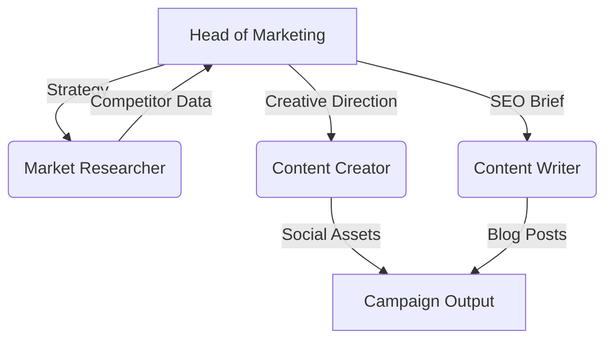

# SubSlash AI: Autonomous FinTech Marketing Agency 🤖💰

> A multi-agent system built with **CrewAI** that autonomously plans, researches, and executes a Go-To-Market strategy for a FinTech product.

## 🧠 Architecture

This isn’t a chatbot — it’s a crew of **4 specialized AI agents** working together to deliver a full campaign for *SubSlash AI* (a fictional subscription negotiation app).



## 🤖 The Agent Crew

| Agent | Role | Function |
| :--- | :--- | :--- |
| **Lead Strategist** | Head of Marketing | Defines personas, orchestrates campaign |
| **Market Scout** | Researcher | Analyzes competitors (Rocket Money, Trim) |
| **Viral Creator** | Social Media Lead | Writes TikTok/Reel scripts for Gen Z |
| **SEO Specialist** | Content Writer | Produces long-form blog posts |

## 📂 Example Outputs

Generated autonomously and stored in `resources/drafts/`:

- 📊 **Market Research Report** – competitor gaps & user pain points  
- 📅 **7-Day Content Calendar** – “Financial Wellness Week” schedule  
- 🎥 **Reel Scripts** – POV-style TikTok/Instagram hooks  
- 📝 **SEO Blog Post** – “Zombie Subscriptions” explainer  

## 🛠️ Tech Stack

- **Framework:** [CrewAI](https://crewai.com)  
- **LLM:** Google Gemini 2.5 Flash lite
- **Language:** Python 3.10+  
- **Tools:** Custom orchestration & file I/O  

## 🚀 How to Run

```bash
# Clone repo
git clone https://github.com/AnasSayed27/SubSlash-AI-Marketing-Agents.git
cd SubSlash-AI-Marketing-Agents

# Install dependencies
pip install crewai crewai-tools

# Run the crew
python crew.py

```

## ⚙️ Configuration & Customization

### **Model & Rate Limits**
This project is configured to use **Google Gemini 2.5 Flash Lite** (or similar fast inference models) via the `litellm` / `crewai` interface.

**Important Note on Rate Limits:**
To ensure stability on free-tier API keys, the agents are currently throttled with a conservative rate limit:
```python
# In crew.py
max_rpm=10 # Requests per minute
